# Project Report
## Course - CS 418 (Introduction to Data Science)
## Term - Fall 2020

## Team - 
- Saurabh Sangwan
- Rakshitha Jayarame Gowda
- Keshvi Srivastava

## Tasks - 
#### 1. Reshape dataset election_train from long format to wide format. Hint: the reshaped dataset should contain 1205 rows and 6 columns.
The data was reshaped from long format to wide format. Earlier, two columns 'Party' and 'Votes' were changed to columns 'Democratic Votes' and 'Republican Votes'. This way we reduced the number of observations, and  got a single unique observation for each unique County and State combination in the data.

#### 2. Merge reshaped dataset election_train with dataset demographics_train. Make sure that you address all inconsistencies in the names of the states and the counties before merging.
Addressing Inconsistencies - 
- In election data, we first removed the sub-string 'County' from the 'County' column. 
- In election data, then we mapped the name of states from abbreviation to full names to match the State names in the demographic data.
- After this we performed some common operations like - 'strip()' and 'upper()'
on 'State' and 'County' columns of both datasets to remove white-spaces and convert the strings
  to Uppercase.

Merging Data - 
We used an inner join on columns 'State' and 'County' to merge the two datasets.

#### 3. Explore the merged dataset. How many variables does the dataset have? What is the type of these variables? Are there any irrelevant or redundant variables? If so, how will you deal with these variables?
- The dataset has 19 variables. Following are the datatypes for each variable - 


- Further, the number of variables for each data types are as follows -
  


- There are two columns - 'Year' and 'Office' which have only a single value  for all observations which are '2018' and 'US Senator' respectively. Since these variables are constant for all the observations we will drop these columns from our dataset.

#### 4. Search the merged dataset for missing values. Are there any missing values? If so, how will you deal with these values?
There are 2(0.17%) and 3(0.25%) missing values for columns 'Republican Votes' and 'Democratic Votes'  respectively. We decided to drop these observations as without these observations we can not determine if the state is Democratic or Republic. Also they were a very small part of the total
observations.<br>
For the column 'Citizen Voting-Age Population' we have 56.67 % of values equal to zero. With this large percentage of missing values we decide to drop the column/variable as we do not believe that it adds much value to our dataset.

#### 5. Create a new variable named “Party” that labels each county as Democratic or Republican. This new variable should be equal to 1 if there were more votes cast for the Democratic party than the Republican party in that county and it should be equal to 0 otherwise.

Given below is the new column created ("Party") by comparing the democratic and republican votes.

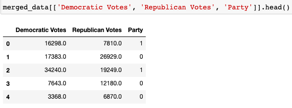

*There is an important observation here to note that there are no counties where the number of democratic and republican votes are the same. (This was tested by simply checking all counties where number of democratic votes was same as republican)*

```ruby
count = merged_data[merged_data['Democratic Votes'] == merged_data['Republican Votes']]['County'].count()
print ("Count: ", count)

Count : 0
```

#### 6. Compute the mean median household income for Democratic counties and Republican counties. Which one is higher? Perform a hypothesis test to determine whether this difference is statistically significant at the 𝜶 = 𝟎. 𝟎𝟓 significance level. What is the result of the test? What conclusion do you make from this result?

The computed means for Median Household Income for Democratic and Republican counties are given below:
Mean Median Household Income for Democratic counties:  53798.732307692306
Mean Median Household Income for Republican counties:  48724.15085714286

We can see that the Democratic mean is higher than the Republican mean by 5074.581450549449. We performed a two-sample t-test to confirm if the mean difference is statistically significant.

**T-Test**:

```
Null Hypothesis : Democratic Mean = Republican Mean
Alternative Hypothesis : Democratic Mean > Republican Mean or Democratic Mean  Republican Mean
t_value : 5.507
p_value : 4.462662928084171e-08   => Calculated for two-tailed test (2*(1-p_value))
alpha : 0.05
```

Since p_value < alpha, we can successfully reject our null hypothesis and claim that the difference in Mean Median Household Income is statistically significant.

#### 7. Compute the mean population for Democratic counties and Republican counties. Which one is higher? Perform a hypothesis test to determine whether this difference is statistically significant at the 𝜶 = 𝟎. 𝟎𝟓 significance level. What is the result of the test? What conclusion do you make from this result?

The computed means for Population for Democratic and Republican counties are given below:
Mean Total Population for Democratic counties:  300998.3169230769
Mean Total Population for Republican counties:  53974.214857142855

We can see that the Democratic mean is higher than the Republican mean by 247024.10206593407. We performed a two-sample t-test to confirm if the mean difference is statistically significant.

**T-Test**:

```
Null Hypothesis : Democratic Mean = Republican Mean
Alternative Hypothesis : Democratic Mean > Republican Mean or Democratic Mean < Republican Mean
t_value : 8.001
p_value : 2.886579864025407e-15   => Calculated for two-tailed test (2*(1-p_value))
alpha : 0.05
```

Since p_value < alpha, we can successfully reject our null hypothesis and claim that the difference in Mean Population is statistically significant.

#### 8. Compare Democratic counties and Republican counties in terms of age, gender, race and ethnicity, and education by computing descriptive statistics and creating plots to visualize the results. What conclusions do you make for each variable from the descriptive statistics and the plots?
Blue - 1- Democratic
Red - 0 - Republic

#### AGE
Percent of people with age between 29 and 65 are more in number for voting. Lesser percentage of people of age 65 and older are noted.  
Also we note that the age 65 and older people have voted more for Democratic

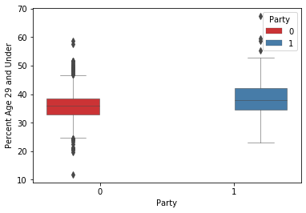  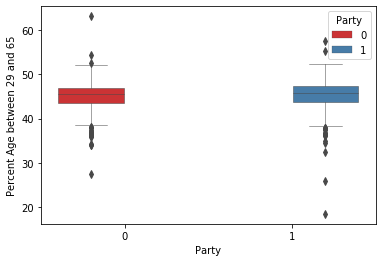 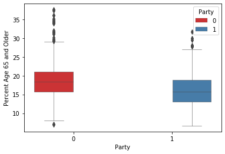

#### GENDER
The percentage of female and male voters are consistent,short boxes indicate that there is consistency in the distribution of the data.
There are outliers 1.5 times the inter-quartile range, lower quartile for female and upper quartile for male

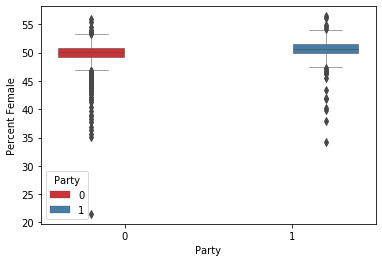  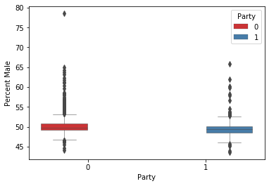

#### RACE
The percentage of white, not Hispanic or Latino are majority of voters, also there is likely difference between the two party voters.

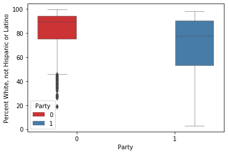  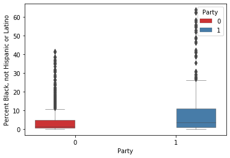 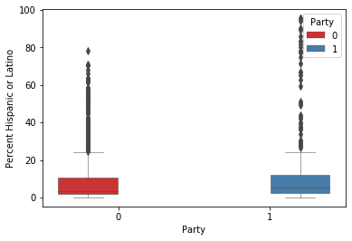

#### ETHNICITY
The percentage of foreign born have more voting for Republic where as the percentage of non foreign born have more vote for Democratic.

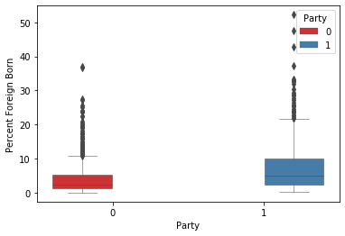  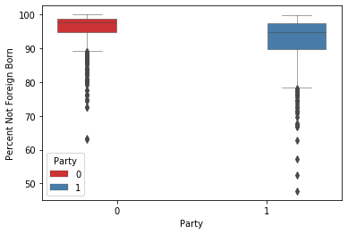 

#### EDUCATION
There are less percentage of voters who have not taken high school degree .This can also infer that the voters are educated with minimum of a bachelors degree.

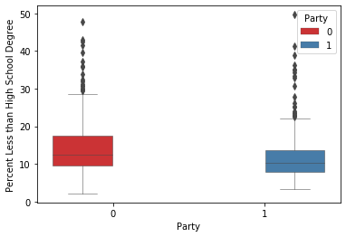  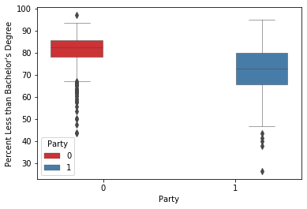 

#### 9. Based on your results for tasks 6-8, which variables in the dataset do you think are more important to determine whether a county is labelled as Democratic or Republican? Justify your answer.
We reject the null hypothesis for <b>mean median household income</b> <br>
There is sufficient evidence to conclude that mean median household income may not be equal for both the party. <br>

We reject the null hypothesis <b>mean population</b> <br>
There is sufficient evidence to conclude that mean total population may not be equal for both the party. <br>

We have sufficient evidence to conclude that both the parties have differences in two of the many attributes (mean median household icome and mean total population), however, for further analysis we can refer to the Age, Race, Ethnicity and education of the voters to determine whether a county is labelled as Democratic or Republican. <br>
<b>Justification</b>

- AGE: The population with age 65 and older are supporters of Democratic, where as the rest of the lower age group people have moslty votes for Republic <br>
- GENDER: There is no significant inference with the population classified as female as male <br>
- RACE: The majority voters (white, not Hispanic or Latino) have voting for Republic where as the minority have their preference as Democratic<br>
- ETHNICITY: Here we can note that foreign born people have more than average voters for Democratic where compared to the non foreign born population <br>
- EDUCATION: Here we can make conclusion on just the population without bachelors degree. Both the population with less than high school degree and bachelors degree have more support for Democratic.


#### 10. Create a map of Democratic counties and Republican counties using the counties’ FIPS codes and Python’s Plotly library (plot.ly/python/county-choropleth/). Note that this dataset does not include all United States counties
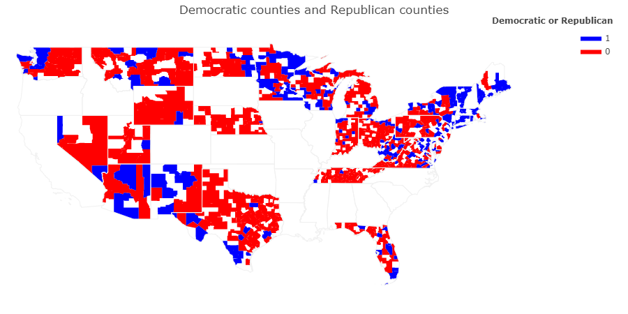 


