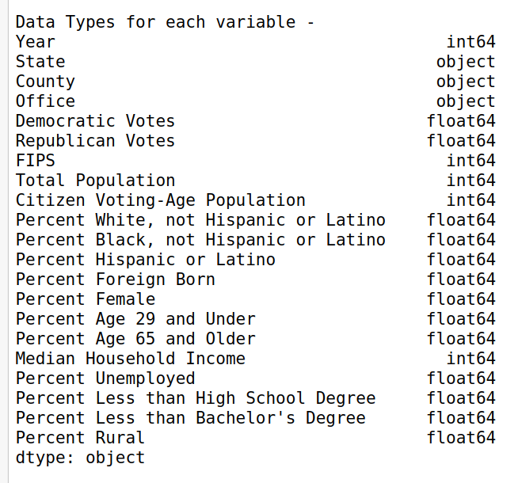

# Project Report
## Course - CS 418 (Introduction to Data Science)
## Term - Fall 2020

## Team - 
- Saurabh Sangwan
- Rakshitha Jayarame Gowda
- Keshvi Srivastava

## Tasks - 
#### 1. Reshape dataset election_train from long format to wide format. Hint: the reshaped dataset should contain 1205 rows and 6 columns.
#### 2. Merge reshaped dataset election_train with dataset demographics_train. Make sure that you address all inconsistencies in the names of the states and the counties before merging.
#### 3. Explore the merged dataset. How many variables does the dataset have? What is the type of these variables? Are there any irrelevant or redundant variables? If so, how will you deal with these variables?
- The dataset has 19 variables. Following are the datatypes for each variable - 

- Further, the number of variables for each data types are as follows -
  

- There are two columns - 'Year' and 'Office' which have only a single value 
for all observations which are '2018' and 'US Senator' respectively. Since these
  variables are constant for all the observations we will drop these columns from our dataset.

#### 4. Search the merged dataset for missing values. Are there any missing values? If so, how will you deal with these values?
There are 2 and 3 missing values for columns 'Republican Votes' and 'Democratic Votes' 
respectively.  
For the column 'Citizen Voting-Age Population' we have 56.67 % of values equal to
zero. With this large percentage of missing values we decide to drop the column/variable 
as we do not believe that it adds much value to our dataset/